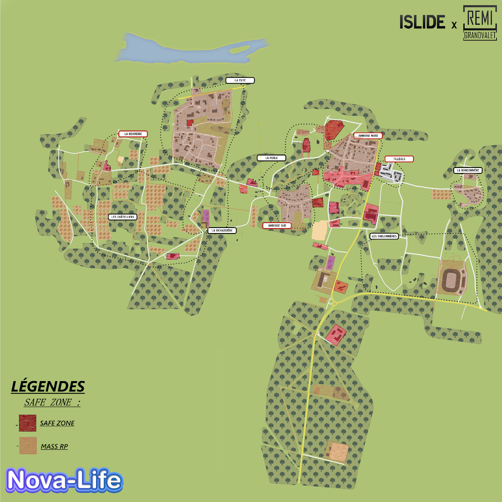

---
hide:
  - footer
---

# 📖 Règlement

Afin de garantir une expérience de jeu optimale pour tous, veuillez vous conformer aux règles énumérées ci-dessous.

Votre coopération est essentielle pour préserver l'harmonie de la communauté.

---

??? abstract "🤝・1. Respect & Intégrité"
    ??? info "1.1 Comportement respectueux"

        Il n’est pas permis de manquer de respect, insulter ou tenir des propos discriminatoires envers un autre membre.  
        Les **propos misogynes, racistes, xénophobes, homophobes, ou tout autre propos à caractère haineux** et qui portent atteinte à quiconque sont formellement interdits.

    ??? info "1.2 Respect du staff"

        Tous les membres du staff méritent votre respect. Rappelez vous qu’ils sont ici pour aider bénévolement dans leur temps libre. Nous vous prions donc de respecter cette règle sous peine de sanction.
    
    ??? info "1.3 Logiciels de triche et utilisation de failles"

        Les **cheats, usebugs, glitchs** et toutes autres formes de logiciels tierces pouvant vous avantager, tels que les **auto-clickers**, sont strictement interdits sur Life Santos sous peine de **wipe/bannissement permanent**.
    
    ??? info "1.4 Troll"

        Tout type d'actions pouvant s'apparenter à du **troll** sont interdites et **strictement sanctionnées** par notre équipe. Veillez à adopter une attitude conforme au Rôle Play.
    
    ??? info "1.5 Pseudonymes Respectueux"

        Il est interdit d'utiliser des **pseudonymes troll, incluant des jeux de mots ou des noms de personnalités publiques**.
        Les pseudonymes doivent être respectueux et **ne pas porter atteinte à la réputation ou à la dignité d'autrui**. (exemple: Adolf Litière, Jean Neymar, Emmanuel Macron etc...) Cette règle vise à maintenir un environnement de jeu respectueux et à éviter toute confusion ou mauvaise intention liée à l'utilisation de pseudonymes.
    
    ??? info "1.6 Attitude Discord"

        Les propos écris ainsi que les images postés dans nos différents salons doivent être **respectueux de tout âges** et ne pas aller à l'encontre de l'image de Nova-Life et du serveur. Nous nous engageons à maintenir une atmosphère agréable et sécurisante pour tous en supprimant tout type de contenus qui pourrait être inapproprié.

    ??? info "1.7 Politique"

        Il est **interdit de diffuser des idées politiques externes au RP en jeu**. Les propos relatifs à la politique réelle, tels que "Vive Bardella" ou "Vive Jean-Luc Mélenchon", ne sont pas autorisés.
    
    ??? info "1.8 Publicité"

        La **publicité & la promotion**, sauf pour les entreprises, est **interdite** sur le serveur.
        Celle-ci est uniquement autorisé dans les salons appropriés.

    ??? info "1.9 StreamHack"

        Utiliser des informations obtenues via un stream (**TikTok, Kick, Twitch, etc.**) pour influencer le jeu est strictement **interdit**. Cela dégrade l'expérience pour les streamers et pour l'ensemble de la communauté.
    
    ??? info "1.10 Soundboard"

        L'utilisation de soundboard est **strictement interdite** sauf en cas de demande précise auprès du gouvernement qui pourra faire l'objet d'une approbation temporaire.

??? abstract "💼・2. Les entreprises"
    ??? info "2.1 Création d'entreprise"

        Toute création d'entreprise se passe par [**📩│tickets**](https://discord.com/channels/1150376178742468638/1150376180554408079).  
        Deux méthodes de création sont possibles chez nous :

        - La méthode gratuite par dossier, à condition que l'entreprise soit à reprendre dans ⁠[**📻│entreprise-disponibles**](https://discord.com/channels/1150376178742468638/1150376181493927951).  
        - La méthode payante via notre ⁠[**👑│boutique**](https://discord.com/channels/1150376178742468638/1187052629306650635).

    ??? info "2.2 Secteur d'activité"

        Toutes les entreprises se doivent de rester dans leur secteur d'activité.
    
    ??? info "2.3 Partenariats & Respect des prix"

        Toutes les entreprises du secteur commercial (ExoStation, Carrefour, etc.) doivent obtenir des partenariats avec les entreprises existantes en ville pour pouvoir vendre les produits, ainsi que s'aligner sur les tarifs des mécaniciens pour toutes pièces mécaniques (200€ de plus qu'eux sur les tarifs).
    
    ??? info "2.4 Limite de jardinières"

        Pour favoriser nos entreprises agricoles, une limite de **3 petites jardinières maximum par terrain** à été mise en place pour les particuliers. Les autres types d'entreprises n'ont bien entendu pas le droit d'avoir leurs propres plantations.
    
    ??? info "2.5 Distributeurs"

        Une fois votre entreprise créée, il faudra faire une demande par **⁠📩│tickets** pour pouvoir accéder à des distributeurs , ceux-ci étant réservés et bloqués à tout achat via le Dépôt Presto. Tout manquement entrainera la suppression de ceux-ci sans remboursement possible.
    
    ??? info "2.6 Démarche de fermeture d'entreprise"

        Une entreprise ferme automatiquement lorsque le @〃PDG décide de quitter le navire. Elle ne peut être ni donnée, ni revendue à une autre personne (sauf autorisation particulière du gouvernement au préalable).

    ??? info "2.7 Terrains et objets"

        Les terrains, objets et machines fournis par le gouvernement lors de la création d'une entreprise sont considérés comme ancrés à l'entreprise et **ne peuvent donc pas être revendus**.
    
    ??? info "2.8 Modifications de Véhicules"

        Certaines modifications de véhicules sont strictement réglementées. Par exemple :  

        - Les **gyrophares bleus** sont réservés exclusivement aux **services de secours**.
        - Les **PMV** (Panneaux à Messages Variables) sont uniquement autorisés pour **les pompiers et la D.I.R**.  

        ❌ Tout abus ou non-respect de ces règles entraînera la suppression immédiate de l’équipement concerné, sans possibilité de remboursement.

??? abstract "🏠・3. Les terrains"
    ??? info "3.1 Limite de terrains"

        Nous autorisons **un terrain personnel** et **un terrain entreprise** par citoyen uniquement.

    ??? info "3.2 Limite de props (objets) par terrain"

        - **Terrain Normal :** 300 props.
        - **Terrain Entreprise Normal :** 450 props.
        - **Terrain Privé @〃V.I.P :** 500 props.
        - **Terrain entreprise @〃V.I.P :** 700 props.
        - **Terrain privé @〃 V.I.P + :** 700 props.
        - **Terrain entreprise @〃 V.I.P + :** 1200 props.
    
    ??? info "3.3 Inactivité"

        En cas d'**inactivité de plus de 6 jours** vous devrez prévoir vos absences et passer les biens que vous ne souhaitez pas perdre à une personne de confiance (Staffs non inclus et co-propriétaire non inclus, uniquement les propriétaires comptent). Autrement une suppression systématique et sans retour sera effectuée. Par ailleurs, si nous constatons une maison sans mapping et laissée à l'abandon, le staff se réserve le droit de retirer son propriétaire sans avertissement, aucun remboursement ne sera alors possible.
    
    ??? info "3.4 Limite de véhicules par terrain"

        Un seul véhicule garé par terrain est autorisé. Des stows réguliers seront effectués (surtout en centre-ville). Une indulgence raisonnable est prévue pour les entreprises ainsi que lorsque les personnes sont connectées.
    
    ??? info "3.5 Constructions HRP"

        Les constructions abusives et sortant du cadre RP sont interdites et pourront être retirées sans remboursement de notre part donc soyez prudent et préventif. (Exemple : Rooftop, agrandissements difformes, plateformes volantes, etc.)  
        Exception à la règle :  

        - Build Custom dans les terrains type "Champs" éloigné des points d'influences.
        - Les devantures/locaux dédiés aux entreprises ne dénaturant pas la zone.
    
    ??? info "3.6 Achat Revente Immobilier"

        Dans le cadre du maintien d'une économie stable, le plafond de profit sur un acte d'Achat Revente en Immobilier est fixé à 25 % du prix du bien en question (valeur de revente au niveau de la Mairie). Par exemple :  

        - Prix d'achat d'une maison = 375 000 € 
        - Prix max de revente = 468 750 € Bénéfice = 93 750 €  

        En cas de non respect, **votre bien sera saisi et aucun remboursement ne sera effectué**.

    ??? info "3.7 Limite de champs par terrain"

        **Un maximum de 10 champs** sont autorisés par terrain pour les entreprises agricoles. Tout manquement à cette règle entraînera un wipe du terrain.

??? abstract "🎮・4. Investissement Rôle Play"
    ??? info "4.1 Engagement Rôle Play"

        Afin de garantir l'immersion et le réalisme le plus élevé, votre engagement est nécessaire dans la construction d'échanges et de scènes riches et durables. **Le HRP est strictement prohibé** et toutes interventions staffs devront être effectués après avoir terminé intégralement vos interactions afin de garantir la continuité globale (hors cas spécifique grave).

    ??? info "4.2 Cohérence RP"

        Chaque joueur doit **maintenir une cohérence dans son rôle**. Par exemple, vous ne pouvez pas être à la fois maire et baron de la drogue. Rappelez-vous que nous sommes à Amboise et non dans le cartel de Cali.
    
    ??? info "4.3 HRP Vocal"

        Il est interdit de faire du HRP Vocal. Vos propos et vos réactions doivent **être en accord avec le cadre RP en cours**. Ainsi vous devez être conscient que des termes tels que : "ça bug", "j'appelle un admin", "tu vas être banni" " la map" etc ... sont donc à exclure de votre vocabulaire pour privilégier au maximum l'immersion et l'expérience de votre personnage ainsi que ceux autour de vous. Veillez donc à trouver des alternatives pertinentes de communication pour éviter toutes perturbations.
    
    ??? info "4.4 Double RP"

        Le double RP est interdit, que cela soit par la création d'un second personnage sur son compte principal ou bien même par le biais de l'utilisation d'un second compte STEAM. Toute infraction à cette règle sera sanctionné d'un wipe immédiat. Toute utilsation de multiples personnages dans le but de générer de l'argent entraînera un wipe intégral de l'ensemble de vos personnages.
    
    ??? info "4.5 Fairplay"

        Au sein de la communauté de Life Santos nous avons pour ambitions de valoriser l'intégralité de nos citoyens. Ainsi il est important pour tous de ne pas être égoïste, de reconnaitre et prendre un recul nécessaire afin de ne pas faire preuve de mauvaise foi. Vous devez comprendre que **perdre fait aussi partie du jeu**. Toutes tentatives pour contourner une action rôle play ne vous plaisant pas sera sanctionnable par nos staffs. (Exemple: prise d'otages, kidnapping, braquage, arrestations, amendes etc ...).
    
    ??? info "4.6 Appels aux services publics"

        Tous les appels aux services publics doivent contenir au moins une formule de politesse, un motif et un lieu. Tout appel ne suivant pas cette formulation ne sera pas pris en compte par nos services et sera également sanctionnable d'un avertissement (warn). 

    ??? info "4.7 No-Pain"

        Vous devez **jouer de manière réaliste**. Si votre personnage est blessé, il doit **agir en conséquence** et cela pas seulement en criant mais en ayant un impact concret sur vos actions (ralentissements, douleurs, perturbations, etc.). Le Pain RP consiste également dans le fait de jouer les émotions, lorsque quelqu'un ou vous même êtes blessé vous ne pouvez être dans vos pleines capacités (Exemple: Une personne se fais assassiner devant vous , un rire ne serai pas le bienvenu). Il faut ainsi choisir la solution la mieux adaptée aux circonstances pour éviter tout abus potentiel.
    
    ??? info "4.8 No-Fear"

        Tout comme le point précèdent ceci consiste à **jouer de manière réaliste votre peur** (Exemple : lorsque vous êtes braqué dans un véhicule à moins de deux véhicules d'écart vous devez impérativement prendre en compte que votre vie est en danger et donc que la fuite n'est pas envisageable). Votre attitude devra s'adapter également en présence d'armes blanches, létales etc. Tout abus et circonstances non conforme à cette règle entraînera des sanctions.

    ??? info "4.9 Conduite HRP"

        Les joueurs doivent respecter le code de la route sauf en cas d'actions rôle play justifiées. **La conduite imprudente ou irréaliste sans raison RP valide est prohibée**. (Exemple : Ne pas écraser un piéton sur la route, suivre les indications de balisage par des plots lors d'accidents sur la route...).
    
    ??? info "4.10 Off-Road"

        Le fait de sortir des routes réservées aux véhicules est strictement interdit, sauf quelques exceptions liées au type de véhicule utilisé :  

        **Non-autorisé :**  

        - Stellar 911 RS
        - Tesla (V Model S)
        - Mazda RX7
        - Dodge charger
        - Olympia A7
        - Véhicules de premier prix (10k à 50k € inclus)
        - Utilitaires & Poids lourds  

        **Autorisé :**  

        - 5008 (Merci d'éviter tout abus)
        - Stellar coupé (Merci d'éviter tout abus)
        - Korn ranger
        - Ranger River
    
    ??? info "4.11 Abus Pôle Travail et auto-école"

        L'utilisation des véhicules d'auto-école et de Pôle Emploi à des fins autres que leur usage principal est strictement interdite. Ces véhicules sont destinés à des activités spécifiques et **ne doivent pas être utilisés de manière abusive pour des activités RP ou d'autres activités non autorisées**. 
    
    ??? info "4.12 Conflit RP"

        Pas de Carkill, Freepunch, Freekill sans justification. Les accidents sont acceptables, mais pas les actes intentionnels. **Les combats sont interdits en centre-ville et à proximité**. Les zones rurales comme la campagne ou la forêt sont exemptées. (Voir également Mass RP & Zones Safe).
    
    ??? info "4.13 Braquage"

        Les braquages sont autorisés uniquement avec une arme à feu ou un couteau. **Les poings, haches, et pioches** ne sont pas considérées comme des armes pour braquer. 
    
    ??? info "4.14 Retour sur scène (NLR)"

        Il est **interdit de revenir sur une scène après avoir été tué ou mis KO**. Par exemple, lors d'une prise d'otage ou d'un braquage, si un policier ou un malfrat est mis hors combat et tombe KO ou meurt, **il ne peut pas se faire soigner et retourner sur la scène**. La scène est considérée comme terminée pour lui. Cette règle vise à maintenir l'intégrité du gameplay et à éviter les retours inappropriés après des événements majeurs.  
        Vous devez laisser un battement de 15 minutes avant de pouvoir retourner sur les lieux sans reprendre à la scène en cours.
    
    ??? info "4.15 Perte de mémoire"

        La perte de mémoire d'un joueur ne peut être provoquée que dans des circonstances spécifiques et par des actions RP appropriées. La seule action permettant de faire perdre la mémoire à un joueur pour une durée de 20 minutes antécédant l'action est la suivante : L'utilisation de votre muscle **F11**. Cette règle vise à encadrer les situations de perte de mémoire de manière réaliste et cohérente dans le contexte du jeu. Elle garantit également que de telles actions ne sont effectuées qu'avec un certain degré de contrôle et de raisonnement RP.
    
    ??? info "4.16 RP à caractère sexuel"

        Il est strictement interdit d'incorporer des éléments à caractère sexuel dans le RP. **Tout contenu explicite ou suggestif**, y compris **les scènes de relations sexuelles, la vulgarité ou le harcèlement sexuel, est proscrit**. Cette règle vise à maintenir un environnement de jeu respectueux et approprié pour tous les participants. Les violations de cette règle peuvent entraîner des sanctions, y compris l'exclusion du jeu.
    
    ??? info "4.17 Double RP vocal"

        Il est interdit de faire du "double RP vocal" sur Discord ou toute autre application. Les interactions entre les joueurs doivent avoir lieu directement en jeu, sauf pour **les services publics & groupes illégaux** qui peuvent utiliser exclusivement Zello pour des communications spécifiques. Il est obligatoire de parler en jeux lorsque vous faites une communication radio susceptible d'être entendue par d'autres personnes (exemple : un policier qui demande des renforts, et qui pourrait donc être entendu par les ravisseurs). Tout canal Zello doit être déclaré au gouvernement afin de prémunir de tout abus potentiel.

    
    ??? info "4.18 Mass RP & Zones safe"

        Le Mass Rp consiste à prendre en compte le fait que certaines zones sont forcément peuplées, même si en jeux nous sommes peu nombreux. Les Zones safe sont les espaces dans lesquels il est strictement interdit d'effectuer tout type d'actions violentes (affrontements, braquage etc ...). Cependant nous tenons à avertir que les comportements doivent restez cohérents et ne pas profiter de ces avantages pour en tirer un profit personnel tel que fuir une scène etc ... vous pourrez retrouver les zones safe de Life Santos ici : [Carte de Zones Safe LS](https://drive.google.com/file/d/1f-1SwVp7O3miqJeNxTnvoT6b9lExwdSE/view?usp=sharing).
    
    ??? info "4.19 Zone de Fusillade"

        Lorsqu'un fusillade est en cours, l'ensemble des services (autres que les forces de l'ordres) **ont interdiction d'intervenir** tant que celle-ci n'est pas finie. Toute intervention (soins, réanimation ou autre) sera sanctionnable.

??? abstract "🆘・5. Assistance et Tickets"
    ??? info "5.1 Droits staff"

        Les membres du staff se réservent le droit d'imposer des sanctions, même pour des raisons non mentionnées dans ce règlement, si cela venait à perturber le rôleplay des autres joueurs.

    ??? info "5.2 Tickets en jeu"

        Sur Life Santos, pour faire un appel aux "papillons" vous devez appuyer sur votre touche **N** pour que votre demande soit prise en compte.  
        
        - Une politesse et des demandes claires sont vivement conseillées.
        - ​L'intervention staff ne devra aucunement couper une scène RP.
    
    ??? info "5.3 Tickets Discord"

        Sur Life Santos, un salon ⁠[**📩│tickets**](https://discord.com/channels/1150376178742468638/1150376180554408079) se trouve à votre disposition, il existe plusieurs catégories de tickets pour une meilleure gestion de vos soucis :  

        - **Support bug technique :** Assistance pour les problèmes techniques liés à des bugs sur le serveur (*Visible par tous les staffs à partir de Modérateur*).
        - **​​Support boutique :** Aide concernant les achats, les transactions ou les problèmes liés à notre boutique en ligne (*Visible uniquement par Fondateur & Développeur*).
        - **Support Remboursements :** Assistance pour les demande de remboursements en jeu (*Visible par tous les Haut gradés à partir de Administrateur*).
        - **Support Création entreprise :** Aide pour la création d'une entreprise, ainsi que tout renseignement complémentaire lié (*Visible par tous les staffs à partir de Modérateur*).
        - **Autres support :** Toutes autres questions ou problèmes ne relevant pas des catégories précédentes (*Visible par tous les Staffs*).
        - **Plainte staff :** Pour tout problème / conflit avec l'un des staffs du serveur Life Santos (*Visible uniquement par les Hauts gradés à partir de Responsable staff*).
        - **Events :** Utilisez cette catégorie si vous souhaitez créer un ticket en rapport avec un évènement de prévu sur le serveur (*Visible par tous les Staffs*).
    
    ??? info "5.4 Arnaque"

        Toute tentative d'arnaque est strictement interdite et sera sanctionnée.
    
    ??? info "5.5 Remboursements"

        Les remboursements suite à un bug ou autre sont possible en cas de **preuve concrète à l'appui**. En l'absence de preuve(s) photo/screen/record, vous ne pourrez être remboursé d'aucun élément. Certaines exceptions par rapport à un bug connu ou un reboot récent pourront être autorisées au bon vouloir des hauts gradés. Nova-life étant un jeu encore en cours d'amélioration les bugs peuvent être fréquents, soyez donc prévoyants.
    
    ??? info "5.6 WIPE - Mort RP - Testament"

        - **WIPE :** Il peut être utilisé comme sanction, mais pas uniquement. Cela consiste en la suppression intégrale et définitive de votre personnage ainsi que tout vos biens y étant reliés. Un wipe peut être effectué en cas de changement rôle play souhaité ou imposé (exemple : Transition entre illégal et forces de l'ordre).
        - **Mort RP :** Pour obtenir l'accès à une Mort RP, vous devez réaliser un dossier complet en ticket afin d'expliquer l'ensemble des raisons et des faits qui vous amènent à vouloir la mort définitive d'un joueur. Par la suite nous examinerons la cohérence de votre dossier afin de déterminer si une Mort RP est nécessaire et possible. En cas de validation, un accompagnement sera fourni à la personne concernée pour ne pas être trop pénalisée.
        - **Testament :** Les testaments sur Life Santos sont interdits. En effet il est impossible de prévoir sa mort ainsi que d'offrir ses biens et sa fortune à un ami ou une connaissance.  

        **TOUTE DÉROGATION À CETTE RÈGLE ENTRAINERA UN WIPE IMMÉDIAT DE TOUTE LES PERSONNES CONCERNÉES**.
    
??? abstract "🌴・6. Fonctionnalités Life Santos"
    ??? warning "6.1 Commandes diverses"

        EN COURS DE RÉDACTION

    ??? info "6.2 Hébergement upload"

        Notre développeur à mis en place un hébergeur d'image directement relié à notre serveur, ce pourquoi pour tout flocage de vêtement ou véhicule vous devrez passer par [**📩│tickets**](https://discord.com/channels/1150376178742468638/1150376180554408079) pour que vous puissiez l'uploader. Ce système est exclusif et vise à pallier différents soucis en plus d'améliorer la charge en jeu pour la fluidité de votre expérience. **TOUTE IMAGE N'ETANT PAS HEBERGÉE CHEZ NOUS EST TOTALEMENT INTERDITE**.
    
    ??? info "6.3 DAB"

        Afin de faire vivre une économie riche et dynamique, une interface bancaire exclusive à Life Santos à été mise en place afin de favoriser des interactions plus poussés et en adéquation avec l'expérience de jeu immersive que nous souhaitons proposer.
    
    ??? info "6.4 Garage Entreprise"

        Dans le cadre de l'amélioration de la vie en entreprise ainsi que celle de l'optimisation, nous avons crée un système exclusif de garage relié à chaque entreprise le souhaitant afin de pouvoir stocker et sortir leur véhicule en temps convenu.
    
    ??? info "6.5 Braquage / DAB & Go Fast"

        Afin de compléter le monde de l'illégal, le rendre plus vaste et divertissant pour tous nous avons ajouté la possibilité d'effectuer un braquage de manière autonome avec certaines restrictions et précisions qui sont disponible sur la réglementation illégale. De plus il existe la possibilité d'effectuer des braquages d'ATM.
    
    ??? info "6.6 Boutique personnalisée (non obligatoire)"

        Pour continuer à **vous offrir un Gameplay de qualité**, nous avons pris l'initiative audacieuse de lancer notre propre boutique en adhérant scrupuleusement aux directives de Nova-Life. Des **rôles exclusifs** tel que : @〃Contributeurs, @〃V.I.P & @〃 V.I.P + pour vous mettre en avant. Nous vous proposons des **Jobs Uniques** ainsi que des **Packs d'Argent**. Si vous êtes intrigué par les possibilités qu'offre notre boutique, ou simplement souhaitez contribuer et soutenir notre ville que vous aimez tant, vous trouverez plus d'informations ici : [**⁠👑│boutique**](https://lifesantos.mysellauth.com/).

    ??? info "6.7 Devenir Staff sur Life Santos"

        Un formulaire est à remplir au propre (bonne écriture et minimum de fautes admises), vous pourrez le retrouver ici : [⁠**📋│candidatures-staffs**](https://discord.com/channels/1150376178742468638/1150376180554408080).  

        **Les Prérequis :**  

        - Avoir 17 ans minimum.
        - Avoir un bon micro.
        - Avoir de l'expérience dans la modération.
        - Motivations démonstratives (6 lignes au minimum).
        - Plus de 20 heures de jeu sur le serveur.
        - Avoir de très bonnes disponibilités (minimum 2H/Jours de Service Admin).
    
??? abstract "📜・7. Annexes Importantes"
    ??? info "7.1 Autres règlements"

        Life Santos possède deux instances essentielles à sa vie et à son identité depuis sa création. C'est pourquoi il nous a semblé crucial d'établir des règlements en relation avec l'univers des Forces de l'ordre & celui de l'Illégal dans l'optique d'établir des règles claires et de pouvoir exposer de manière transparente les possibilités que nous offrons au sein de notre ville.  
        
        Ces règlements sont obligatoires et non contestables et s'ajoutent en adéquation à ce règlement principal. La lecture de ces deux éléments est essentiel et représente une responsabilité personnelle afin de connaître et pouvoir profiter d'une expérience unique, évolutive et enrichissante au sein de Life Santos.  
        
        Veuillez trouver plus d'informations via les liens suivants :  

        - [**Règlement des Forces de l'Ordre**](https://discord.gg/zpPq2uZfbC)
        - [**Règlement Illégal**](https://sites.google.com/view/life-santos/ill%C3%A9gal?authuser=0)

??? abstract "🗺️・8. Map Safe Zone & Zone Mass RP"
    

---

***Ce règlement reste & demeure la propriété de Life Santos, avec clause d'exclusivité.***

***Toute violation, copyright ou infraction aux droits d'auteur s'expose à des poursuites.***