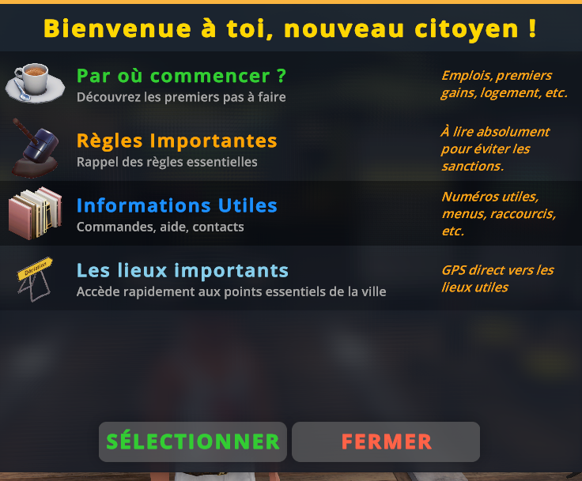

---
hide:
  - footer
---

# 🎒 Bien débuter sur Life Santos

Lors de votre arrivée sur **Life Santos**, il est important d'avoir toutes les informations nécessaires pour bien commencer votre aventure.  
Heureusement, une commande simple existe pour vous aider :

---

## 💡 Commande d’aide

### ```/info```

Cette commande vous ouvre un **panel d’aide complet**, contenant plusieurs sections clés pour bien vous orienter.  
Voici ce que vous y trouverez :

---

### **Par où commencer ?** ⁉️  
Une introduction pour vous guider dans vos **premiers pas RP**, avec des conseils pour débuter sereinement.

---

### **Les règles importantes à connaître avant de vous lancer dans l’aventure Life Santos** ⛔  
Un récapitulatif clair des **règles essentielles** du serveur, afin d’éviter tout faux-pas dès le début.

---

### **Les informations utiles (commandes, aide, contact)** 📚  
Vous y trouverez toutes les commandes indispensables, ainsi que des **contacts utiles** si vous avez besoin d’assistance.

---

### **Les lieux importants avec GPS intégré** 🏎️  
Un accès rapide aux principaux **points d’intérêt** de la ville, avec la possibilité de définir un **point GPS** directement depuis le panel.

---



---

