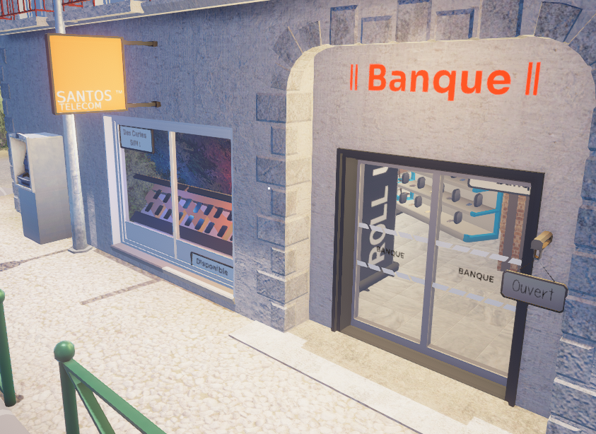

---
hide:
  - footer
---

# 📱 Cartes SIM sur Life Santos

Bienvenue sur la page dédiée aux **cartes SIM** du serveur.  
Elles sont **indispensables** pour passer des appels, envoyer des messages ou communiquer efficacement avec les services publics et entreprises.

---

## 🏦 Où acheter une carte SIM ?

Les cartes SIM sont disponibles à la **Banque principale**, située :

- 🏛️ **En face** de la Mairie et de **Santos Emploi**  
- 📍 Visible depuis la rue principale – voir la devanture ci-dessous :  

🎫 Jusqu’à **3 cartes SIM** peuvent être achetées par joueur.  
🔧 Chaque carte doit être **activée manuellement** après achat.  
📞 Chaque carte dispose de son **propre numéro**.

---

## 💡 À quoi sert une carte SIM ?

Une carte SIM est **obligatoire** pour utiliser votre téléphone ([**`F9`**](../touches/f9.md)) sur le serveur.

### ✅ Fonctions disponibles avec une SIM :

- 📲 Envoyer et recevoir des **messages**
- 📞 Passer et recevoir des **appels**
- 📍 Envoyer sa **localisation** via la commande `/sendloc` *(ex : en cas d’urgence avec la police, EMS ou taxi)*

!!! info "Information"
    💬 Pour envoyer sa position, vous devez être **en appel actif** avec la personne ou le service.

---

## 🏢 Cartes SIM Entreprise

En plus des cartes personnelles, les **entreprises** peuvent aussi acquérir une **carte SIM spéciale entreprise**, disponible **au même point de vente**.

### 🎯 Avantages d'une SIM Entreprise :

- 📟 Accès à la commande `/callcenter`  
  Permet de gérer dynamiquement vos appels en service :
  - `PRENDRE (Nom de l'entreprise + Numéro)` → Vous utilisez le numéro pro.
  - `QUITTER (Nom de l'entreprise + Numéro)` → Retour à votre numéro personnel.

- 📞 Accès au bouton "CALLCENTER"  
  → Transférez l’appel en cours vers un **collègue en service**.

!!! warning "Attention"
    🚨 Ces fonctions sont **réservées aux employés en service**.

---

## 🗣️ **Appels : Formule Obligatoire**

Une **formule de politesse est obligatoire** pour tout appel, que ce soit vers un joueur ou un service public.

## 🧾 Schéma à respecter :

### ✅ Exemples valides :
- "Bonjour, je suis à l'hôpital, j’ai besoin d’un médecin rapidement."
- "Bonsoir, je suis au garage nord, ma voiture est bloquée."

!!! warning "Attention"
    ⚠️ Un appel sans respect de ce format pourra être **ignoré** ou **sanctionné**.

---

## 🙋 Besoin d’aide ?

- 💬 Pour tout problème d’activation ou numéro manquant, ouvrez un ticket dans la catégorie `📩 | tickets` sur Discord.
- 📌 N'oubliez pas que **toute carte activée est liée à votre personnage**, pas de transfert possible !

---

## 🧠 Astuce RP

Une carte SIM est plus qu’un simple outil : c’est un **élément RP essentiel** pour communiquer comme dans la vraie vie.  
**Pensez à la gérer avec sérieux**, surtout si vous êtes employé dans un service public ou entreprise.

---

Merci de respecter l’usage prévu des cartes SIM pour garantir une **expérience de jeu immersive et fluide** pour tous !
